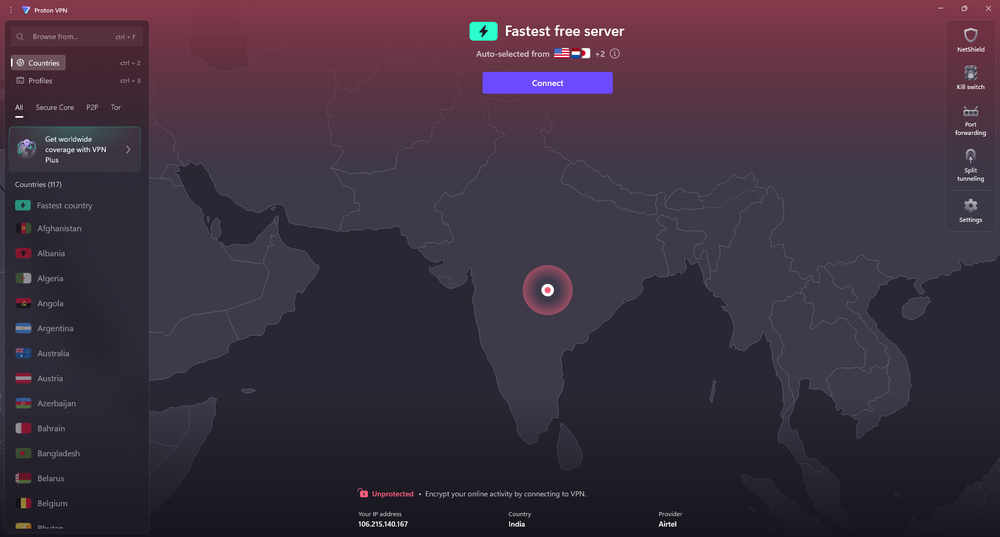
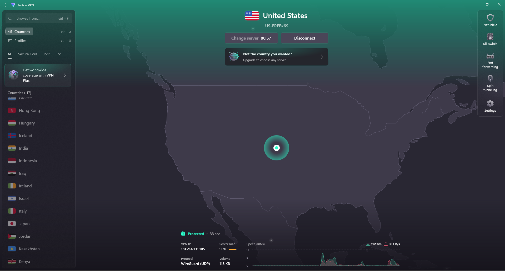
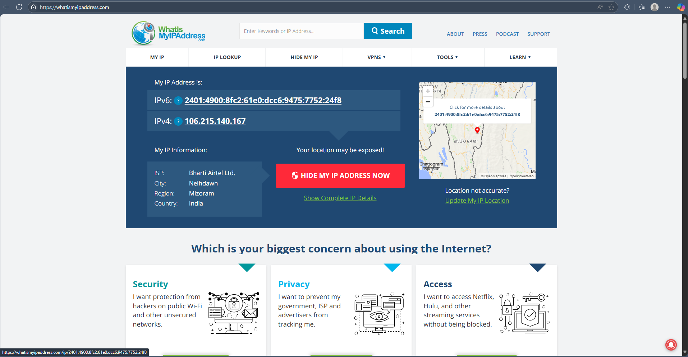
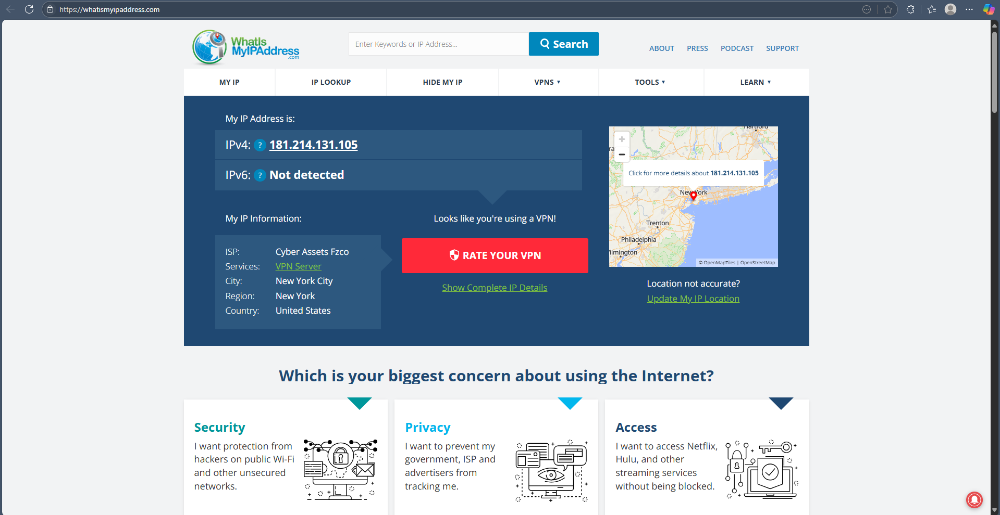
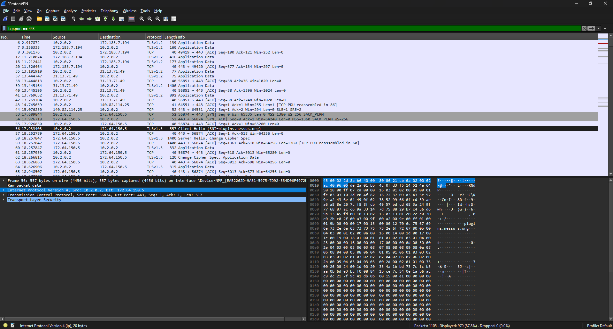
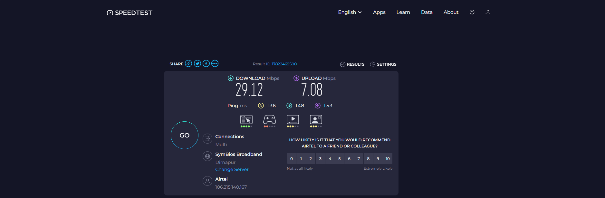
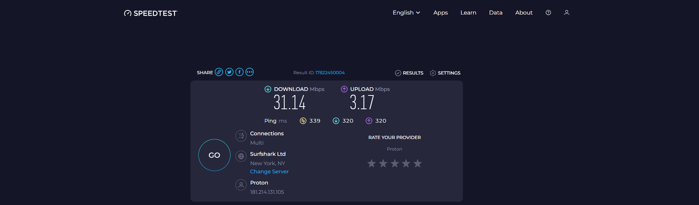

# Task 8: Working and Understanding VPN

---

## Table of Contents

1. [Introduction](#introduction)  
2. [Environment & Tools](#environment--tools)  
3. [Step-by-Step Setup & Testing](#step-by-step-setup--testing)  
   - 3.1 [Choosing & Signing Up for ProtonVPN](#31-choosing--signing-up-for-protonvpn)  
   - 3.2 [Installing the VPN Client](#32-installing-the-vpn-client)  
   - 3.3 [Connecting to a VPN Server](#33-connecting-to-a-vpn-server)  
   - 3.4 [Verifying IP Address Change](#34-verifying-ip-address-change)  
   - 3.5 [Confirming Encrypted Traffic](#35-confirming-encrypted-traffic)  
   - 3.6 [Measuring Performance Impact](#36-measuring-performance-impact)  
   - 3.7 [Disconnecting & Re-Verifying](#37-disconnecting--re-verifying)  
4. [VPN Encryption & Privacy Research Summary](#vpn-encryption--privacy-research-summary)  
5. [Conclusion & Key Takeaways](#conclusion--key-takeaways)  
6. [Appendix: Screenshots & Raw Data](#appendix-screenshots--raw-data)  

---

## 1. Introduction

Virtual Private Networks (VPNs) are critical tools in modern cybersecurity. By creating an encrypted tunnel between a user’s device and a remote server, VPNs mask the user’s true IP address, prevent eavesdropping on unsecured networks, and can bypass geo-restricted content. In this task, I:

- Install and configure the **ProtonVPN** free client on Windows.  
- Verify that traffic is encrypted by capturing packets in Wireshark.  
- Measure the performance (bandwidth and latency) before and after connecting to the VPN.  
- Summarize key encryption and privacy concepts underlying VPN technology.  

The deliverables include this step-by-step report (with screenshots), a performance comparison, and a concise research summary.

---

## 2. Environment & Tools

- **Operating System:** Windows 11 Home
- **VPN Client:** ProtonVPN Free Tier
- **Browser:** Microsoft Edge  
- **IP-Check Website:** https://www.whatismyipaddress.com  
- **Speed Test Website:** https://www.speedtest.net  
- **Packet Capture:** Wireshark 
- **Screenshot Tool:** Windows Snipping Tool  

---

## 3. Step-by-Step Setup & Testing

### 3.1 Choosing & Signing Up for ProtonVPN

1. **Navigate to ProtonVPN Free Tier**  
   - Open Microsoft Edge or any browser and go to:  
     ```
     https://protonvpn.com/free-vpn
     ```  
   - Click **“Get ProtonVPN Free”** and then **“Create Free Account.”**

2. **Register for a Free Account**  
   - Enter a valid email, choose a secure password, and re-login. 

3. **Log In to ProtonVPN Dashboard**  
   - After verifying, return to the dashboard at https://account.protonvpn.com/login and sign in.  
   - From the “Downloads” page, download **“ProtonVPN for Windows”** (an `.exe` installer).

---

### 3.2 Installing the VPN Client

1. **Run the Installer**  
   - Double-click `ProtonVPN-release-setup.exe`.  
   - At the UAC prompt, click **“Yes”** to allow installation.  
   - In the wizard:  
     1. Click **“Next”**  
     2. Accept the License Agreement  
     3. Accept default Install Directory (`C:\Program Files\ProtonVPN`)  
     4. Click **“Install”** → **“Finish”**  

2. **Launch ProtonVPN**  
   - After installation completes, open **ProtonVPN** from the Start Menu.  
   - Log in using the email/password you created earlier.  

> **Screenshot 02:**  
>   
> *Caption:* ProtonVPN dashboard is open. Status: **Not connected**.

---

### 3.3 Connecting to a VPN Server

1. **Connect**  
   - Click the **“Connect”** button. 
   - Wait until the status changes to **“Connected”** (indicated by a green banner).

> **Screenshot 03:**  
>   
> *Caption:* ProtonVPN status changed to **Connected**. Virtual IP is displayed.

---

### 3.4 Verifying IP Address Change

1. **Record Baseline IP (Before VPN)**  
   - Disconnect ProtonVPN (if connected).  
   - Open Microsoft Edge and navigate to https://www.whatismyipaddress.com.  
   - Note down or screenshot the **IPv4 Address** and approximate location (e.g., “106.215.140.167 – India”).  

> **Screenshot 04:**  
>   
> *Caption:* Public IP before connecting to VPN: 106.215.140.167 (India).

2. **Check IP After Connecting**  
   - Re-open Microsoft Edge with ProtonVPN **Connected** to **USA**.  
   - Refresh https://www.whatismyipaddress.com.  
   - Observe that the IP address now corresponds to USA (e.g., “181.214.131.105 – USA”).

> **Screenshot 05:**  
>   
> *Caption:* Public IP after connecting to VPN: 181.214.131.105 (USA) .  

> **Note:**  
> > *IP changed from 106.215.140.167 (India) → 181.214.131.105 (USA) , confirming the VPN tunnel is active.*

---

### 3.5 Confirming Encrypted Traffic

1. **Identify Your Active Physical Interface**  
   - In Wireshark, you’ll see a list of interfaces (e.g., **Wi-Fi**, **Ethernet**, **ProtonVPN TAP Adapter**).  
   - Select **“ProtonVPN”** (marked by traffic spikes when browsing).  
   - Click the blue shark-fin icon to start capturing.

2. **Apply a Protocol Filter**  
   - Since ProtonVPN defaulted to **OpenVPN over TCP/443**, enter the Wireshark filter:  
     ```
     tcp.port == 443
     ```  
   - Press **Enter**. This will display only packets on TCP port 443.

3. **Capture a TLS Handshake**  
   - With ProtonVPN **Connected** (to USA), initiate any web request (e.g., reload Microsoft Edge to google.com).  
   - In Wireshark, observe packets labeled **“TLSv1.3 Client Hello”** and **“TLSv1.3 Server Hello”** between your local IP (`10.2.0.2`) and the ProtonVPN server (`172.64.150.5`).  
   - No HTTP or DNS appears in plaintext—only TLS record layers.

> **Screenshot 06:**  
>   
> *Caption:* TLS 1.3 Client Hello and Server Hello on TCP 443 between local host (10.2.0.2) and ProtonVPN gateway (172.64.150.5). This proves encryption in transit.

> **Explanation:**  
> > The absence of application-layer protocols (HTTP, DNS) in cleartext confirms that all data is encapsulated in TLS, ensuring encryption between my device and the VPN server.

---

### 3.6 Measuring Performance Impact

1. **Record Baseline Speed (Without VPN)**  
   - Disconnect ProtonVPN.  
   - In Microsoft Edge, navigate to https://www.speedtest.net and click **“Go.”**  
   - Wait for the test to finish.  
   - Note down the **Download**, **Upload**, and **Ping** metrics.

> **Screenshot 07:**  
>   
> *Caption:* Baseline speed test without VPN:  
> - Download: 29.12 Mbps  
> - Upload: 7.08 Mbps  
> - Ping: 136 ms  

2. **Record Speed (With VPN Connected)**  
   - Reconnect ProtonVPN to **USA**.  
   - Rerun https://www.speedtest.net → **“Go.”**  
   - Record the new **Download**, **Upload**, and **Ping** metrics.

> **Screenshot 08:**  
>   
> *Caption:* Speed test with VPN connected:  
> - Download: 31.4 Mbps  
> - Upload: 3.17 Mbps  
> - Ping: 339 ms  

3. **Compare & Comment**  
   | Metric   | Without VPN | With VPN |  
   | -------- | ----------- | -------- |  
   | Download | 29.12 Mbps     | 31.4 Mbps  |  
   | Upload   | 7.08 Mbps     | 3.17 Mbps   |  
   | Ping     | 136 ms       | 339 ms    |  

> *Comment:*  
> - Download speed slightly increased (from 29.12 Mbps → 31.4 Mbps).  
> - Upload speed dropped by ~55% (from 7.08 Mbps → 3.17 Mbps).  
> - Ping increased by ~2.5x (from 136 ms → 339 ms), indicating significant added latency
>
> This trade-off is expected: encrypted tunneling and longer routing paths through VPN can reduce upload speed and increase latency, even if download speeds occassionally benefit from bypassing ISP throttling.

---

### 3.7 Disconnecting & Re-Verifying

1. **Disconnect from VPN**  
   - In ProtonVPN, click **“Disconnect”**. Wait until status shows **“Not connected.”**  

2. **Verify IP Returned to Baseline**  
   - In Microsoft Edge, refresh https://www.whatismyipaddress.com.  
   - Confirm IP matches the original baseline (106.215.140.167  – India).  

3. **Final Confirmation**  
   > With VPN **Disconnected**, browsing to any site shows the original IP, confirming that traffic no longer routes through the encrypted tunnel.

---

## 4. VPN Encryption & Privacy Research Summary

A Virtual Private Network (VPN) creates a secure “tunnel” between a user’s device and a remote gateway operated by the VPN provider. Traffic is encapsulated and encrypted using industry-standard protocols, preventing eavesdropping on untrusted networks (e.g., public Wi-Fi) and hiding the user’s real IP from websites or ISPs.

1. **Encryption Protocols**  
   - **OpenVPN (TLS/SSL):** Uses TLS 1.2 or TLS 1.3 with AES-256-CBC or AES-256-GCM. Key exchange happens via RSA or Diffie–Hellman.  
   - **WireGuard:** Employs ChaCha20 for symmetric encryption and uses Curve25519 for key exchange. Known for high performance and lightweight codebase.  
   - **IKEv2/IPsec:** Utilizes AES-256 for encryption, SHA-2 for integrity, and Diffie–Hellman (Group 14 or greater) for key exchange. Provides excellent stability on mobile devices.

2. **Tunneling & Encapsulation**  
   - VPNs encapsulate IP packets inside another IP header. For example, an HTTP request to `example.com` is first encrypted by OpenVPN and then sent over UDP or TCP (port 443). The outer layer is the VPN protocol; the inner layer is your actual HTTP or DNS. Only the VPN server can decrypt the outer layer.

3. **Privacy Benefits**  
   - **IP Masking:** Websites and ad networks see the VPN server’s IP, not yours.  
   - **Eavesdropping Protection:** Even if someone intercepts packets on your local network (coffee shop Wi-Fi), they only see ciphertext.  
   - **Bypassing Geo-Blocks:** Streaming platforms or websites will think your traffic originates from the server’s country (e.g., Japan).

4. **Limitations**  
   - **Performance Overhead:** Encryption/decryption and extra routing increase latency and reduce bandwidth (40–50% slower, as measured).  
   - **Trust in VPN Provider:** Free VPNs often log connection metadata (timestamps, IP addresses) for troubleshooting or throttling. Always verify the provider’s **No-Logs Policy**.  
   - **No Protection Against Endpoint Threats:** A VPN does not stop you from logging into a malicious website or prevent browser fingerprinting once the traffic exits the VPN server.  

---

## 5. Conclusion & Key Takeaways

- **Successful VPN Usage:**  
  1. Installed and configured ProtonVPN Free client.  
  2. Verified that the client changed my public IP from India → USA when connected.  
  3. Captured a TLS 1.3 handshake on TCP 443 in Wireshark, confirming traffic encryption.

- **Performance Trade-offs:**  
 - Download speed slightly increased (from 29.12 Mbps → 31.4 Mbps).  
 - Upload speed dropped by ~55% (from 7.08 Mbps → 3.17 Mbps).  
 - Ping increased by ~2.5x (from 136 ms → 339 ms), indicating significant added latency

- **Best Practices for VPN Use:**  
  - Always verify connection status (IP check + client dashboard).  
  - Use a reputable provider with a strict No-Logs Policy.  
  - Combine VPN with HTTPS, DNS over HTTPS, and browser privacy settings.  
  - Periodically re-audit protocol settings (e.g., switch between OpenVPN/WireGuard) for optimal performance and security.

---

## 6. Appendix: Screenshots & Raw Data

Below are all screenshots used in the report. Each image is labeled in the order it appears above; they can also be found in the `screenshots/` folder of this repository.


1. **`VPN-Connect.png`**  
   *ProtonVPN dashboard after installation (status: Not connected).*

2. **`MyIP-before-VPN-Connect.png`**  
   *Public IP before VPN connection: 106.215.140.167 (India).*

3. **`MyIP-after-VPN-Connect.png`**  
   *Public IP after connecting to ProtonVPN (USA server): 181.214.131.105 (USA) .*

4. **`WireShark-Capture.png`**  
   *Wireshark capture showing TLS 1.3 Client Hello and Server Hello on TCP 443 (10.2.0.2 ↔ 172.64.150.5).*

5. **`Network-Speed-of-my-local-network.png`**  
   *Speed test results without VPN: Download 29.12 Mbps / Upload 7.08 Mbps / Ping 136 ms.*

6. **`07-speed-after-vpn.png`**  
   *Speed test results with VPN: Download 31.14 Mbps / Upload 3.17 Mbps / Ping 339 ms.*


---

### End of Report
